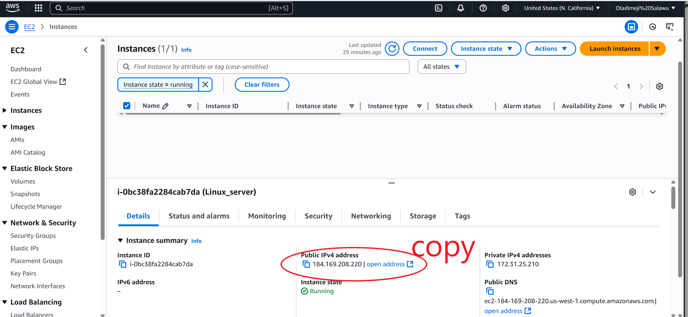
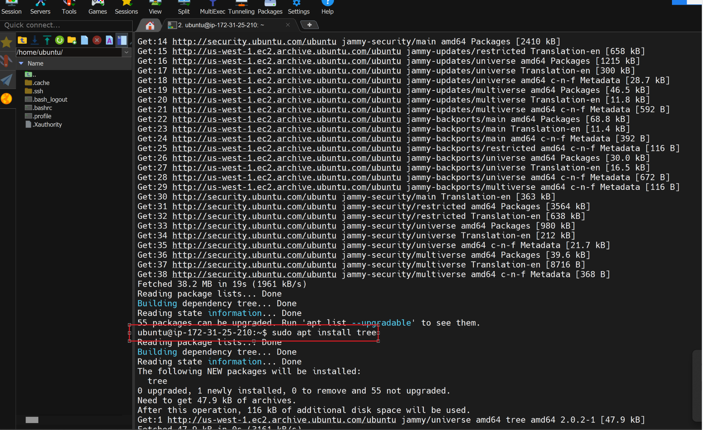

# Linux_server
How to run an  ubuntu instance on aws and connect using Mobaxterm
# Linux Server Setup Guide

Welcome to the **Linux_server** repository! This guide details the professional, step-by-step process of configuring a Linux server, using **Windows Subsystem for Linux (WSL)** and **MobaXterm** for connectivity. Each step is documented with screenshots located in the `linux/` folder, providing clear visual references for every major configuration milestone.

## Table of Contents

1. [Introduction](#introduction)
2. [Prerequisites](#prerequisites)
3. [Setup Steps](#setup-steps)
    ### Step 1: Login into your AWS account
    ### Step 2: search for EC2 on search bar and select instance
    ### Step 3: Click on create instance
    ### Step 4: configure instance
    ### Step 5: choose free tier
    ### Step 5: create key pair
    ### Step 6: input name of server and memory
    ### Step 7:  click launch instance button create instance
    ### Step 8: copy the Ip address of the running instance  
    ### Step 9: Connecting to Your Server using ssh
    ### Step 10: locate the downloaded key.pem
    
4. [Software management](#troubleshooting)
5. [Removing software](#references)


## Introduction

This repository provides guide on how to use AWS a public cloud provider to create the an server in the cloud and access it on our local machine. we will make use of the EC2 instance ( Elastic Cloud Compute)
## Prerequisites

- AWS account
- **Mobaxterm for Windows ** or **PuTTY** installed on your Windows machine
- Download and install: https://mobaxterm.mobatek.net/


## Setup Steps

### Step 1: Login into your AWS account
Do not sign in as the root user(Best practices)
 

### Step 2: search for EC2 on search bar and select instance

 
     
### Step 3: Click on create instance
 

### Step 4: configure instance


### Step 5: choose free tier


### Step 5: create key pair
 

### Step 6: input name of server and memory
 

### Step 7:  click launch instance button create instance


### Step 8: copy the Ip address of the running instance


### Step 9: Connecting to Your Server using ssh
Open the Terminal on Mobaxterm
### Step 3: Open MobaXterm terminal


### Step 10: locate the downloaded key.pem
    ```
    cd ~/Downloads
    ```
 
 look for the file using
```
ls
```
  

Use MobaXterm to establish an SSH connection:

```bash
ssh -i key.pem ubuntu@184.162.172.1
```

- Example in **MobaXterm**:  
  

Click yes when prompted


### Step 11: System Update

Update package lists and upgrade existing packages:

```bash
sudo apt update && sudo apt upgrade -y
```


### Step 12: Essential Software Installation

Install necessary software packages (e.g., Nginx, Git, tree ):

```
sudo apt install nginx
```

```
sudo apt install tree 
```


```bash
sudo apt install nginx 
```


---

### Step 13: Additional Configurations

make any additional explorations as needed for your use case (e.g., tree, nginx, web servers, databases, etc.).


---

## deleting or removing software

### Use this command to remove tree
```
sudo apt remove tree
```
---
Feel free to try other packages e,g nfs