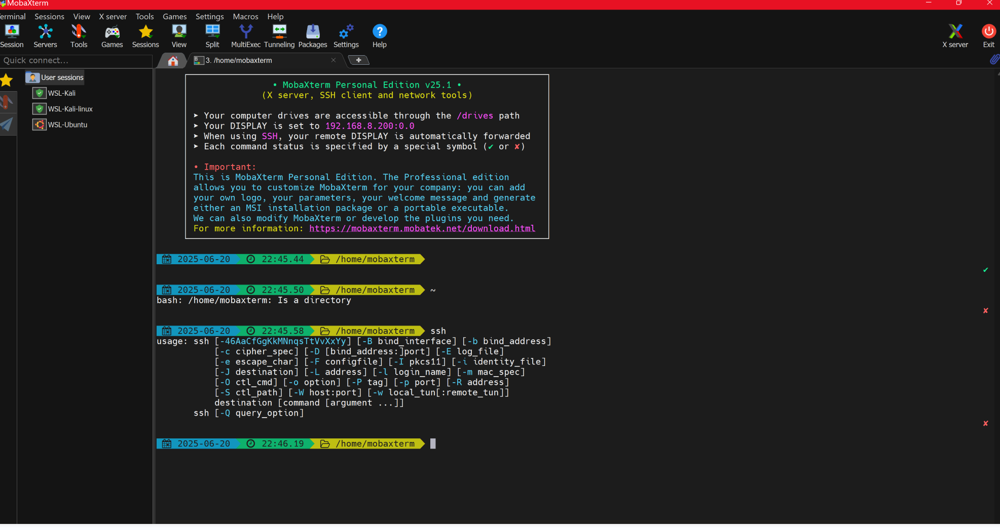
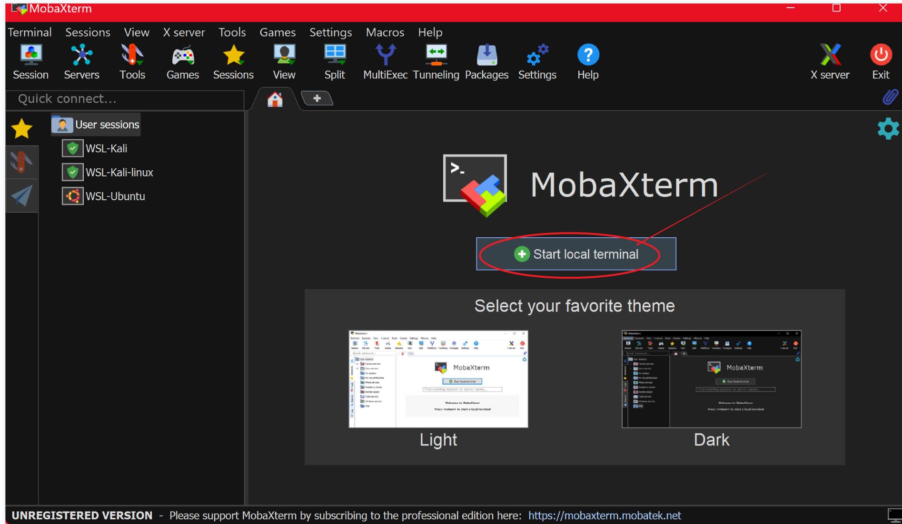
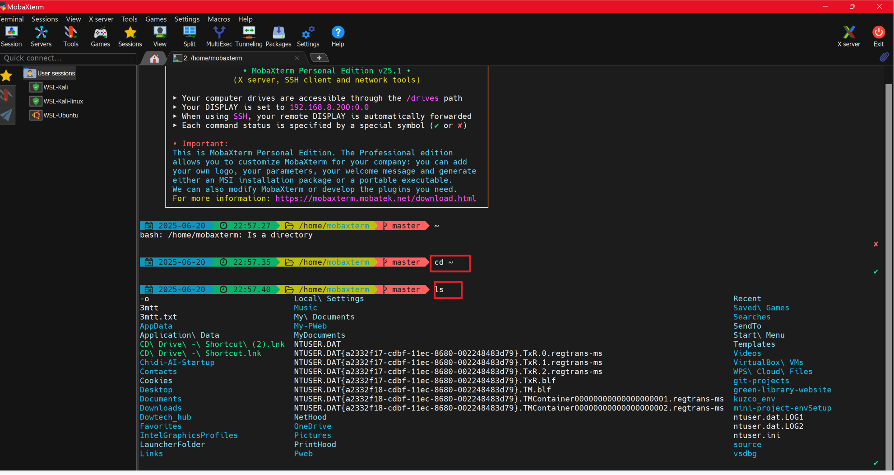
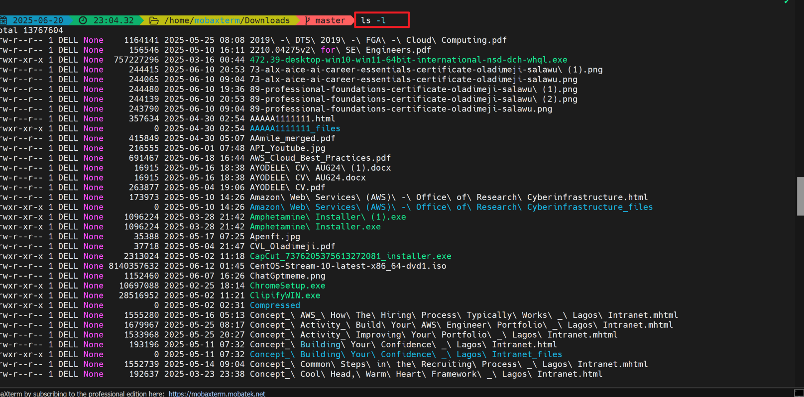
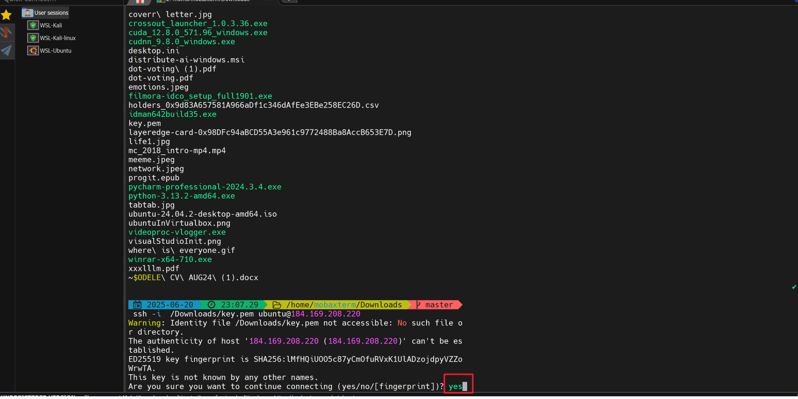
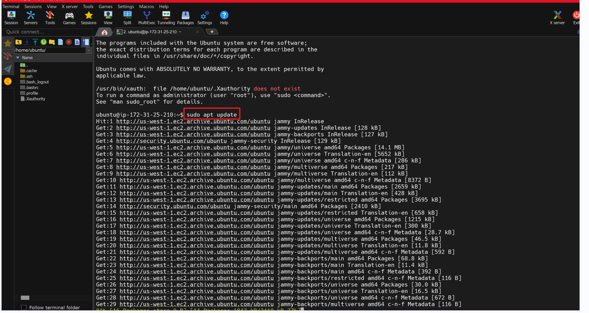
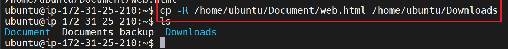

#### 2nd Projecj goes here
# Linux Command
Linux commands runs on the command line Interface (CLI)


## Table of Contents


## This repository provides guide on linux commands on the CLI
## Prerequisites

- Linux account
- **Linus Distro, like Ubuntu, centos, redhat etc


## Setup Steps

### Step 1: Login linux machine in virtual box or Debian
 You can as well connect your EC2 Instance on AWS

### Step : copy the Ip address of the running instance


### Step : Connecting to Your Server using ssh
Open the Terminal on Mobaxterm
### Step : Open MobaXterm terminal



### Step 10: locate the downloaded key.pem
    ```
    cd ~/Downloads
    ```
 
 list all files using;
```
ls
```
 
```
ls -l
```
  

## Use MobaXterm to establish an SSH connection:

```bash
ssh -i key.pem ubuntu@184.162.172.1
```

- Example in **MobaXterm**:  
  

Click yes when prompted



### Step 11: System Update

## Update package lists and upgrade existing packages:

```bash
sudo apt update && sudo apt upgrade -y
```



### Step 12: Essential Software Installation

## Linux Syntax; 
CommandName {options(s)} {parameter(s)
For example to create a folder


```
mkdir /root/example

```
If fail; Try superuser do
```
sudo mkdir /root/example

```
To see the present working directory use


```bash
pwd
```
Navigate directories and folders using cd + /bin, /root, /usr, /home, /var, /etc, / example, below 


```bash
cd /
```

Sudo mean Superuser do: gives you access to execute like the root user.

```bash
sudo mkdir filename
```
```bash
sudo cd /
```
To list files and directories in the filesystem,

```bash
ls -l
```
for root filesystems use
```bash
sudo ls -l
```

make any additional explorations as needed for your use case (like creating directories, copying, deleting, renaming  and moving files in linux system).
To make create a folder

```bash
sudo mkdir filename
```
To create file

```bash
touch file.txt
```
To copy file

```bash
cp filename.txt /home/ubuntu/Documents
```

```bash
cp filename1.txt filename2.txt filename3.txt /home/username/Documents

```

```bash
cp -R /home/username/Documents /home/username/Documents_backup

```
To move file

```bash
mv filename.txt /home/ubuntu/Documents

```
```bash
mv old_filename.txt new_filename.txt

```
###Cat means concatenate a file


## deleting or removing file and adding optional flags -i, -r, -R


How to list files with an added fla (-R -a -1h)


### Use this command to remove tree
```
rm 
```
---
Feel free to try other packages e,g nfs. 
Drop your comment and suggestions.
